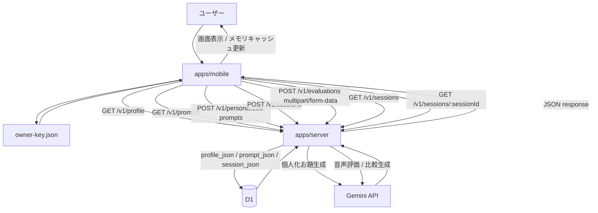

# kotoba-gym I/F ドキュメント

## 1. 目的

このドキュメントは、`kotoba-gym` の現在実装におけるモジュール間インターフェースをまとめたものです。
対象は次の 3 境界です。

- `apps/mobile` と `apps/server` の HTTP API
- `packages/core` が提供する共有スキーマ / 型
- モバイルアプリ内部で画面間・永続化に使っている契約

## 2. 全体構成

依存方向は次のとおりです。

```text
apps/mobile
  -> @kotoba-gym/core
  -> apps/server (HTTP)

apps/server
  -> @kotoba-gym/core
  -> Gemini API
  -> D1

packages/core
  -> zod
```

各モジュールの責務:

| モジュール      | 役割                                           | 外部公開 I/F                                                     |
| --------------- | ---------------------------------------------- | ---------------------------------------------------------------- |
| `apps/mobile`   | 画面表示、録音、API 呼び出し、端末識別子保持   | Expo Router の画面ルート、`src/lib/api.ts`、`src/lib/storage.ts` |
| `apps/server`   | API 提供、入力検証、Gemini 呼び出し、D1 永続化 | `/health`、`/v1/*`                                               |
| `packages/core` | 共有型、Zod schema                             | `@kotoba-gym/core` の export                                     |

### 2.1 通信経路フロー

主要な通信経路は次のとおりです。



補足:

- mobile が永続化するのは `ownerKey` のみです
- `profiles`, `prompts`, `sessions` の正本は server / D1 です
- 評価時だけ音声ファイルを multipart で送信し、結果は JSON で返します

## 3. 共有コントラクト

`packages/core` は mobile / server 間の境界型を提供します。

### 3.1 練習お題

| 型                           | 概要                                                                              |
| ---------------------------- | --------------------------------------------------------------------------------- |
| `PracticePrompt`             | 1問分のお題                                                                       |
| `PracticePromptCategory`     | `tech-explanation` / `design-decision` / `reporting` / `interview` / `escalation` |
| `PracticePromptDuration`     | `30〜45秒` / `45〜60秒` / `60〜90秒`                                              |
| `PersonalizedPracticePrompt` | `PracticePrompt` に `personalized: true` を加えた型                               |

`PracticePrompt` の shape:

```ts
type PracticePrompt = {
  id: string;
  category: PracticePromptCategory;
  title: string;
  prompt: string;
  situation: string;
  goals: string[];
  durationLabel: PracticePromptDuration;
};
```

### 3.2 プロフィール

```ts
type PersonalizationProfile = {
  role: string;
  roleText: string;
  strengths: string[];
  strengthsText: string;
  techStack: string[];
  techStackText: string;
  scenarios: string[];
};
```

制約:

- `role`: 1文字以上
- `strengths`, `techStack`, `scenarios`: 1件以上 8件以下
- `roleText`: 80文字以下
- `strengthsText`, `techStackText`: 120文字以下

### 3.3 評価結果

評価軸:

- `conclusion`
- `structure`
- `specificity`
- `technicalValidity`
- `brevity`

主要型:

```ts
type EvaluationScore = {
  axis: ScoreAxis;
  score: 1 | 2 | 3 | 4 | 5;
  comment: string;
};

type AttemptEvaluation = {
  transcript: string;
  summary: string;
  scores: EvaluationScore[]; // 5件固定
  goodPoints: string[]; // 1..3
  improvementPoints: string[]; // 1..3
  exampleAnswer: string;
  nextFocus: string;
  comparison: AttemptComparison | null;
};
```

`comparison` は 2 回目回答時のみ値を持ちます。

### 3.4 セッション

```ts
type PracticeSessionAttempt = {
  attemptNumber: number; // 1 or 2
  recordedAt: string; // ISO8601
  evaluation: AttemptEvaluation;
};

type PracticeSessionRecord = {
  id: string;
  prompt: PersonalizedPracticePrompt;
  attempts: PracticeSessionAttempt[]; // 最大2件
  createdAt: string; // ISO8601
  updatedAt: string; // ISO8601
};
```

## 4. モバイル内部 I/F

### 4.1 画面ルート

| ルート                            | 用途                                 | 主な入力                |
| --------------------------------- | ------------------------------------ | ----------------------- |
| `/`                               | ホーム                               | なし                    |
| `/onboarding`                     | プロフィール入力とお題生成           | なし                    |
| `/topic/[promptId]`               | お題詳細                             | `promptId`              |
| `/practice/[promptId]`            | 録音画面                             | `promptId`, `sessionId` |
| `/session/[sessionId]/analyzing`  | 解析待機                             | `sessionId`             |
| `/session/[sessionId]/feedback`   | 評価表示                             | `sessionId`             |
| `/session/[sessionId]/comparison` | 1回目/2回目比較                      | `sessionId`             |
| `/history`                        | 練習履歴                             | なし                    |
| `/profile`                        | プロフィール確認 / 再生成 / リセット | なし                    |

### 4.2 端末識別子

認証は未実装で、代わりに mobile が `ownerKey` を生成して API の所有者識別に使います。

- 保存先: `Paths.document/kotoba-gym/owner-key.json`
- 内容:

```json
{
  "ownerKey": "owner-<timestamp>-<random>"
}
```

- 初回アクセス時に生成
- 以降はすべての `/v1/*` API に送信

### 4.3 API ベースURL解決

優先順位:

1. `EXPO_PUBLIC_API_BASE_URL`
2. Expo の `hostUri` から `http://<host>:8787`
3. 既定値 `http://127.0.0.1:8787`

### 4.4 セッションキャッシュ

`apps/mobile/src/lib/storage.ts` は `Map<string, PracticeSessionRecord>` を使ってセッションをメモリキャッシュします。

- `createPracticeSession(prompt)`:
  サーバーでセッションを作成し、返却値をキャッシュ
- `getPracticeSession(sessionId)`:
  キャッシュ優先、未取得ならサーバー取得
- `listPracticeSessions()`:
  サーバー一覧を取得し、各セッションをキャッシュ
- `cachePracticeSession(session)`:
  解析完了後の最新セッションで上書き

注意:

- セッション本体は mobile に永続化せず、server / D1 を正本とします
- 履歴画面の表示データもサーバーの `GET /v1/sessions` に依存します
- 初回起動で `profile` / `prompts` / `sessions` がすべて空の場合は `/onboarding` に遷移します

### 4.5 録音アップロード契約

`POST /v1/evaluations` 送信時の multipart field:

| フィールド      | 型     | 必須 | 備考                                            |
| --------------- | ------ | ---- | ----------------------------------------------- |
| `ownerKey`      | string | 必須 | 端末識別子                                      |
| `sessionId`     | string | 必須 | 練習セッションID                                |
| `promptId`      | string | 必須 | お題ID                                          |
| `attemptNumber` | string | 必須 | `"1"` または `"2"`                              |
| `locale`        | string | 必須 | mobile では既定値 `ja-JP`                       |
| `audio`         | file   | 必須 | mobile は `attempt-<n>.m4a`, `audio/m4a` で送信 |

## 5. HTTP API

共通:

- CORS: `origin: *`
- 返却形式: JSON
- エラー形式:

```json
{
  "error": {
    "code": "invalid_request",
    "message": "入力が不正です。内容を確認して再試行してください。",
    "retryable": false
  }
}
```

### 5.1 `GET /health`

疎通確認用。

レスポンス:

```json
{
  "ok": true
}
```

### 5.2 `GET /v1/profile`

クエリ:

| 名前       | 型     | 必須 |
| ---------- | ------ | ---- |
| `ownerKey` | string | 必須 |

レスポンス:

```json
{
  "profile": {
    "role": "Frontend Engineer",
    "roleText": "",
    "strengths": ["説明が得意"],
    "strengthsText": "",
    "techStack": ["React Native"],
    "techStackText": "",
    "scenarios": ["設計レビュー"]
  }
}
```

未保存時は `profile: null`。

### 5.3 `PUT /v1/profile`

リクエスト:

```json
{
  "ownerKey": "owner-...",
  "profile": {
    "role": "Frontend Engineer",
    "roleText": "",
    "strengths": ["説明が得意"],
    "strengthsText": "",
    "techStack": ["React Native"],
    "techStackText": "",
    "scenarios": ["設計レビュー"]
  }
}
```

レスポンス:

```json
{
  "profile": {}
}
```

実際には保存後の `PersonalizationProfile` 全体を返します。

### 5.4 `DELETE /v1/personalization`

クエリ:

| 名前       | 型     | 必須 |
| ---------- | ------ | ---- |
| `ownerKey` | string | 必須 |

動作:

- `profiles`
- `prompts`
- `sessions`

を同じ `ownerKey` 単位で削除します。

レスポンス:

```json
{
  "ok": true
}
```

### 5.5 `GET /v1/prompts`

クエリ:

| 名前       | 型     | 必須 |
| ---------- | ------ | ---- |
| `ownerKey` | string | 必須 |

レスポンス:

```json
{
  "prompts": [PersonalizedPracticePrompt]
}
```

注意:

- この API は「既に保存済みの個人化お題一覧」のみを返します
- 固定お題のフォールバックはありません

### 5.6 `POST /v1/personalized-prompts`

リクエスト:

```json
{
  "ownerKey": "owner-...",
  "profile": {
    "role": "Frontend Engineer",
    "roleText": "",
    "strengths": ["説明が得意"],
    "strengthsText": "",
    "techStack": ["React Native"],
    "techStackText": "",
    "scenarios": ["設計レビュー"]
  }
}
```

動作:

1. `profile` を保存
2. Gemini で 5 問生成
3. `prompts` に保存
4. 保存済みお題を返却

レスポンス:

```json
{
  "prompts": [PersonalizedPracticePrompt, PersonalizedPracticePrompt, PersonalizedPracticePrompt, PersonalizedPracticePrompt, PersonalizedPracticePrompt]
}
```

件数は 5 件固定です。

### 5.7 `POST /v1/sessions`

リクエスト:

```json
{
  "ownerKey": "owner-...",
  "promptId": "prompt-id"
}
```

レスポンス:

```json
{
  "session": {
    "id": "session-...",
    "prompt": {},
    "attempts": [],
    "createdAt": "2026-04-22T00:00:00.000Z",
    "updatedAt": "2026-04-22T00:00:00.000Z"
  }
}
```

補足:

- `promptId` は `ownerKey` 配下の保存済み prompt に一致する必要があります
- 不一致時は `404 prompt_not_found`

### 5.8 `GET /v1/sessions`

クエリ:

| 名前       | 型     | 必須 |
| ---------- | ------ | ---- |
| `ownerKey` | string | 必須 |

レスポンス:

```json
{
  "sessions": [PracticeSessionRecord]
}
```

返却順は `updatedAt` 降順です。

### 5.9 `GET /v1/sessions/:sessionId`

クエリ:

| 名前       | 型     | 必須 |
| ---------- | ------ | ---- |
| `ownerKey` | string | 必須 |

レスポンス:

```json
{
  "session": PracticeSessionRecord
}
```

未存在時は `404 session_not_found`。

### 5.10 `POST /v1/evaluations`

`multipart/form-data` で送信します。

前提チェック:

- `audio` が存在すること
- `sessionId` が存在すること
- `session.prompt.id === promptId` であること
- `session.attempts.length < 2` であること
- 音声 MIME type がサポート対象であること

対応 MIME type:

- `audio/aac`
- `audio/m4a`
- `audio/mp4`
- `audio/mpeg`
- `audio/mp3`
- `audio/ogg`
- `audio/opus`
- `audio/wav`
- `audio/webm`
- `audio/x-wav`

レスポンス:

```json
{
  "attemptNumber": 1,
  "evaluation": {
    "transcript": "...",
    "summary": "...",
    "scores": [
      {
        "axis": "conclusion",
        "score": 4,
        "comment": "..."
      }
    ],
    "goodPoints": ["..."],
    "improvementPoints": ["..."],
    "exampleAnswer": "...",
    "nextFocus": "...",
    "comparison": null
  },
  "session": PracticeSessionRecord
}
```

2 回目回答では `evaluation.comparison` に比較結果が同梱されます。

主なエラーコード:

| code                                    | status | 意味                                   |
| --------------------------------------- | ------ | -------------------------------------- |
| `invalid_request`                       | 400    | JSON / form validation 失敗            |
| `audio_required`                        | 400    | `audio` 欠落                           |
| `unsupported_audio_format`              | 400    | 非対応音声形式                         |
| `prompt_mismatch`                       | 400    | セッションのお題と `promptId` が不一致 |
| `attempt_limit_reached`                 | 400    | 3回目以降の送信                        |
| `prompt_not_found`                      | 404    | セッション作成対象のお題が存在しない   |
| `session_not_found`                     | 404    | 対象セッションが存在しない             |
| `personalized_prompt_generation_failed` | 500    | 個人化お題生成失敗                     |
| `evaluation_failed`                     | 500    | 評価生成失敗                           |

## 6. サーバー内部 I/F

### 6.1 Repository インターフェース

`apps/server/src/repositories/app-repository.ts` の `AppRepository` が永続化境界です。

主な責務:

- `getProfile` / `saveProfile`
- `listPrompts` / `savePrompts` / `getPrompt`
- `createSession` / `getSession` / `listSessions` / `saveSession`
- `clearPersonalization`

実装:

- 本番系: `D1AppRepository`
- テスト / ローカル用: `InMemoryAppRepository`

### 6.2 D1 保存単位

テーブル:

| テーブル   | 主キー            | 保存内容       |
| ---------- | ----------------- | -------------- |
| `profiles` | `owner_key`       | `profile_json` |
| `prompts`  | `(owner_key, id)` | `prompt_json`  |
| `sessions` | `(owner_key, id)` | `session_json` |

特徴:

- JSON 丸ごと保存方式
- `owner_key` 単位でデータ分離
- `prompts`, `sessions` は `updated_at` で一覧取得

## 7. 環境変数

### 7.1 mobile

| 名前                       | 用途                 | 必須 |
| -------------------------- | -------------------- | ---- |
| `EXPO_PUBLIC_API_BASE_URL` | API 接続先の明示指定 | 任意 |

### 7.2 server

| 名前             | 用途                | 必須 |
| ---------------- | ------------------- | ---- |
| `GEMINI_API_KEY` | Gemini API 呼び出し | 必須 |
| `GEMINI_MODEL`   | 使用モデル名        | 任意 |

既定モデルは `gemini-3-flash-preview` です。

## 8. 実装前提

- 固定お題は持たず、練習開始前に個人化お題の生成が必要です
- `personalization-storage.ts` は server API ラッパーとして扱います
- `profiles`, `prompts`, `sessions` は server / D1 を正本にします
- `PracticeSessionRecord.prompt` は `PersonalizedPracticePrompt` です
